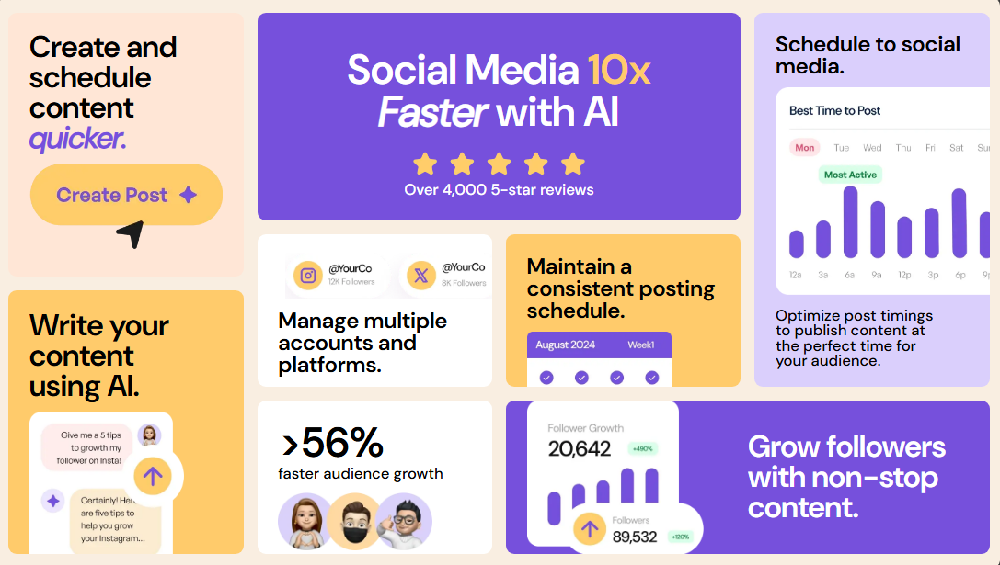
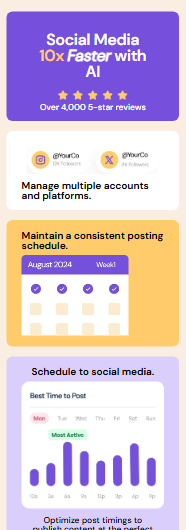
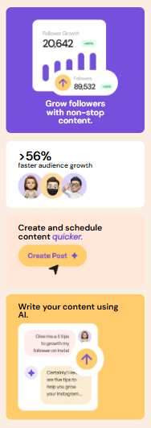

# bento-grid-main

This is a solution to the [bento-grid-main on Frontend Mentor](https://www.frontendmentor.io/challenges/bento-grid-RMydElrlOj). Frontend Mentor challenges help you improve your coding skills by building realistic projects. 

## Table of contents

- [Overview](#overview)
  - [Screenshot](#screenshot)
  - [Links](#links)
- [My process](#my-process)
  - [Built with](#built-with)
  - [What I learned](#what-i-learned)
  - [Continued development](#continued-development)
- [Author](#author)

## Overview

### Screenshot

These are my screenshots showing how the project turned out.

- Desktop design:



- Mobile design:




### Links

- Solution URL: [My Solution](https://gillaercio.github.io/bento-grid-main/)

## My process

### Built with

- Semantic HTML5 markup
- CSS custom properties
- Grid Layout
- Mobile-first workflow

### What I learned

I took advantage of this project to practice using **grid-template-area** and **BEM (Block Element Modifier)**:

Grid-template-area

```css
#content {
  grid-template-columns: repeat(4,1fr);
  grid-template-rows: repeat(10,1fr);
  grid-template-areas:
  "schedule stars stars media"
  "schedule stars stars media"
  "schedule stars stars media"
  "schedule stars stars media"
  "schedule accounts maintain media"
  "ai accounts maintain media"
  "ai accounts maintain media"
  "ai audience followers followers"
  "ai audience followers followers"
  "ai audience followers followers";
}
```

Grid-area

```css
.post--schedule-content { grid-area: schedule; }
.post--five-stars { grid-area: stars; }
.post--social-media { grid-area: media; }
.post--using-ai { grid-area: ai; }
.post--manage-accounts { grid-area: accounts; }
.post--maintain-schedule { grid-area: maintain; }
.post--audience-growth { grid-area: audience; }
.post--grow-followers { grid-area: followers; }
```

BEM (Block Element Modifier)

```html
<article class="post post--five-stars">
  <h1 class="post__title">Social Media <span class="highlight-text">10x</span> <span class="text-title-italic">Faster</span> with AI</h1>
  
  <p class="post__body">Over 4,000 5-star reviews</p>
</article>
```

### Continued development

I would like to improve the use of the **HTML**, **CSS** and **JavaScript**.

## Author

- Frontend Mentor - [@gillaercio](https://www.frontendmentor.io/profile/gillaercio)
- Github - [My Github](https://github.com/gillaercio)
- LinkedIn - [My LinkedIn](https://www.linkedin.com/in/gildman-la%C3%A9rcio/)